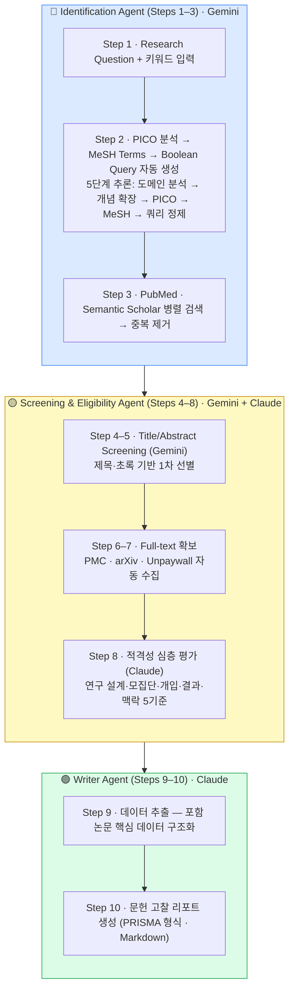

<div align="center">

# [Gachon Scholar](https://github.com/Limminsik/gachonscholar)

**AI 멀티에이전트 기반 체계적 문헌 고찰 자동화 플랫폼**

[](https://nextjs.org/)
[](https://fastapi.tiangolo.com/)
[](https://langchain-ai.github.io/langgraph/)
[](https://www.anthropic.com/)
[](https://deepmind.google/technologies/gemini/)


</div>

---

## 소개

Gachon Scholar는 연구 주제를 입력하면 **PRISMA 2020** 방법론에 따라 논문 검색부터 최종 리뷰 보고서 작성까지 AI가 자동으로 수행하는 체계적 문헌 고찰(Systematic Literature Review) 플랫폼입니다.

연구자가 수 주에 걸쳐 수행하던 작업을 단 몇 분 안에 처리하면서도, 각 단계마다 연구자가 기준을 직접 설정·검토할 수 있는 **Human-in-the-Loop** 구조로 설계되었습니다.

---

## PRISMA 2020 파이프라인



---

## 에이전트 역할 정의

| 에이전트 | PRISMA 단계 | 담당 작업 | 모델 |
|----------|------------|----------|------|
| **Identification Agent** | Step 1–3 | Research Question → 5단계 추론 Search Terms 생성, 다중 DB 병렬 검색, 중복 제거 | Gemini 2.5 Flash |
| **Screening & Eligibility Agent** | Step 4–8 | 제목·초록 1차 선별(Gemini) → 전문 확보 → 적격성 심층 평가(Claude) | Gemini 2.5 Flash + Claude Sonnet 4.6 |
| **Writer Agent** | Step 9–10 | 포함 논문 데이터 추출 및 PRISMA 형식 문헌 고찰 리포트 작성 | Claude Sonnet 4.6 |

### Identification Agent ✅ 구현 완료

> 연구자가 자연어 Research Question과 키워드를 입력하면, 5단계 추론으로 최적화된 Search Terms를 생성하고 다중 DB를 검색합니다.

- **Input**: 연구 목적(자연어) + 연구 키워드
- **5단계 추론 프로세스**:
  1. **도메인 분석** — 연구 영역 및 핵심 근거 파악
  2. **개념 확장** — 각 핵심 개념의 동의어·약어·관련 용어 탐색
  3. **PICO 매핑** — Population / Intervention / Comparison / Outcome 구조화
  4. **MeSH Terms 선정** — PubMed 공식 통제어 선택
  5. **Boolean Query 정제** — 2~4개 핵심 블록만 AND 연결, MeSH 우선·free-text 보완
- **DB 미리보기** — 파이프라인 시작 전 PubMed·Semantic Scholar 예상 건수 확인
- **Output**: 중복 제거된 고유 문헌 목록 + PRISMA Step 1–3 집계

### Screening & Eligibility Agent 🔧 개발 예정

> 수집된 논문을 두 단계로 평가합니다. Gemini가 제목·초록으로 1차 선별하고, Claude가 전문을 직접 읽어 적격성을 심층 평가합니다.

- **Screening (Step 4–5)**: 사용자 포함/제외 기준 기반 제목·초록 1차 선별 (Gemini)
- **Eligibility (Step 6–8)**: PMC·arXiv·Unpaywall 전문 자동 확보 → Claude 5기준 적격성 평가

### Writer Agent 🔧 개발 예정

> 최종 포함된 논문들의 데이터를 추출하고 PRISMA 형식 문헌 고찰 리포트를 작성합니다.

---

## Human-in-the-Loop 게이트

```
[연구 목적·키워드 입력]
        ↓
[Search Terms 검토·수정]  ← 사용자가 Boolean Query 직접 편집 가능
        ↓
[DB 검색 미리보기]        ← 파이프라인 시작 전 예상 건수 확인
        ↓
[Identification 완료]
        ↓
[포함/제외 기준 설정]     ← Screening 시작 전 사용자 입력
        ↓
[Screening & Eligibility]
        ↓
[Writer → 보고서 다운로드]
```

---

## 주요 기능

- **5단계 추론 Search Terms 생성** — 도메인 분석 → 개념 확장 → PICO → MeSH → Boolean Query 정제
- **DB 검색 미리보기** — 파이프라인 시작 전 PubMed·Semantic Scholar 예상 건수 + 범위 적절성 안내
- **다중 DB 병렬 검색** — PubMed, Semantic Scholar 동시 검색 및 제목 기반 중복 제거
- **실시간 진행 스트리밍** — 에이전트 동작과 논문별 판정이 SSE로 라이브 표시
- **세션 영속성** — 단계 완료 시 즉시 DB 저장, 페이지 재방문 시 상태 완전 복원
- **PRISMA Flow Diagram** — 각 단계별 n 수치를 자동 추적하여 시각화
- **중앙 설정 파일** — `configuration.json`으로 모델·검색 파라미터 일괄 관리

---

## 기술 스택

| 영역 | 기술 |
|------|------|
| 프론트엔드 | Next.js 14, TypeScript, Tailwind CSS |
| 백엔드 | NestJS 10, Prisma ORM, PostgreSQL 16 |
| AI 파이프라인 | FastAPI, LangGraph StateGraph |
| Identification AI | Google Gemini 2.5 Flash |
| Eligibility · Writer AI | Anthropic Claude Sonnet 4.6 |
| 논문 검색 소스 | PubMed E-utilities, Semantic Scholar Graph API |
| 실시간 통신 | Server-Sent Events (SSE) |
| 인프라 | Docker Compose |

---

## 프로젝트 구조

```
Cloud-computing/
├── configuration.json     비밀이 아닌 설정 중앙 관리 (모델·검색 파라미터)
├── frontend/              Next.js 14 웹 앱
├── backend/               NestJS API 서버 + PostgreSQL (Prisma)
└── ai-service/            FastAPI AI 파이프라인
    ├── agents/
    │   ├── search_agent.py        Identification — Search Terms 생성 + DB 검색
    │   ├── screening_agent.py     Screening — 제목·초록 1차 선별 (Gemini)
    │   ├── eligibility_agent.py   Eligibility — 전문 기반 적격성 평가 (Claude)
    │   └── writer_agent.py        Writer — 데이터 추출 + 리포트 생성
    ├── graph/             LangGraph 파이프라인
    ├── sources/           PubMed · Semantic Scholar 어댑터
    └── prompts.py         에이전트별 LLM 프롬프트
```

---

## 개발 현황

### ✅ 완료
- Identification Agent — 5단계 추론 Search Terms 생성, 다중 DB 검색, 중복 제거
- DB 검색 미리보기 — 파이프라인 시작 전 예상 건수 확인
- SSE 실시간 스트리밍
- 세션 영속성 및 상태 복원
- PRISMA Flow Diagram 시각화
- `configuration.json` 중앙 설정 관리

### 🔧 개발 예정
- Screening & Eligibility Agent — PICO 기반 자동 기준 생성, Gemini 1차 선별 + Claude 전문 평가
- Writer Agent 고도화 — 섹션별 구조화 보고서, 참고문헌 자동 포맷
- 검색 DB 확장 — EMBASE, Cochrane Library 연동

---

## 실행 방법

```bash
git clone https://github.com/Limminsik/gachonscholar.git
cd gachonscholar/Cloud-computing

cp .env.example .env
# .env에 API 키 입력: GOOGLE_API_KEY, ANTHROPIC_API_KEY

docker-compose up --build
# → http://localhost:3000
```

---

*가천대학교 · 클라우드컴퓨팅 프로젝트*
