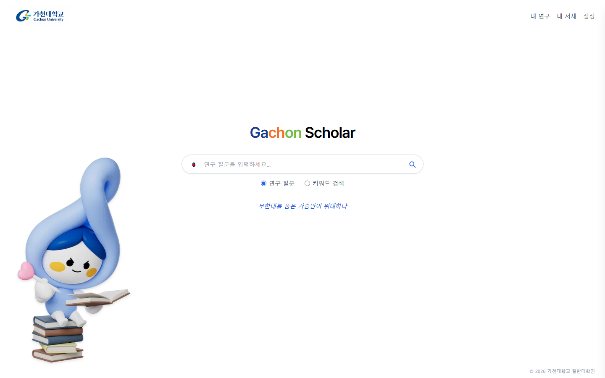
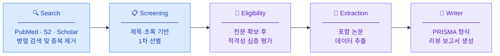

<div align="center">

# [Gachon Scholar](https://github.com/Limminsik/gachonscholar)

**AI 멀티에이전트 기반 체계적 문헌 고찰 자동화 플랫폼**

[](https://nextjs.org/)
[](https://fastapi.tiangolo.com/)
[](https://langchain-ai.github.io/langgraph/)
[](https://www.anthropic.com/)
[](https://deepmind.google/technologies/gemini/)



</div>

---

## 소개

Gachon Scholar는 연구 주제를 입력하면 **PRISMA 2020** 방법론에 따라 논문 검색부터 최종 리뷰 보고서 작성까지 AI가 자동으로 수행하는 체계적 문헌 고찰(SLR) 플랫폼입니다.

연구자가 수 주에 걸쳐 수행하던 작업을 단 몇 분 안에 처리하면서도, 각 단계마다 연구자가 기준을 직접 설정·검토할 수 있는 **Human-in-the-Loop** 구조로 설계되었습니다.

---

## 파이프라인



> Search · Screening · Eligibility 단계 사이에서 연구자가 포함/제외 기준을 직접 설정하고 다음 단계를 실행합니다.

---

## 주요 기능

- **실시간 진행 스트리밍** — 에이전트 동작과 논문별 포함/제외 판정이 SSE로 라이브 표시
- **단계별 기준 직접 설정** — 각 PRISMA 단계 전에 포함/제외 기준을 자유롭게 입력하거나 생략 가능
- **전문(Full-text) 자동 확보** — PubMed Central, arXiv, Unpaywall, OA PDF를 순차적으로 시도
- **세션 영속성** — 단계 완료 시 즉시 DB 저장, 페이지 재방문 시 SSE 재연결로 상태 완전 복원
- **논문 필터 탐색** — PRISMA 단계별·판정별 필터와 검색어 하이라이팅
- **보고서 다운로드** — 최종 리뷰 보고서를 Markdown 파일로 내보내기

---

## 기술 스택

| 영역 | 기술 |
|------|------|
| 프론트엔드 | Next.js 14, TypeScript, Tailwind CSS |
| 백엔드 | NestJS 10, Prisma ORM, PostgreSQL 16 |
| AI 파이프라인 | FastAPI, LangGraph StateGraph, MemorySaver |
| 검색·선별 AI | Google Gemini 2.5 Flash Lite |
| 적격성·보고서 AI | Anthropic Claude Sonnet 4.6 |
| 논문 검색 소스 | PubMed E-utilities, Semantic Scholar Graph API, SerpAPI |
| 실시간 통신 | Server-Sent Events (SSE) |
| 인프라 | Docker Compose |

---

## 프로젝트 구조

```
Cloud-computing/
├── frontend/          Next.js 14 웹 앱
├── backend/           NestJS API 서버 + PostgreSQL (Prisma)
├── ai-service/        FastAPI AI 파이프라인
│   ├── agents/        Search · Screening · Eligibility · Extraction · Writer
│   ├── graph/         LangGraph 파이프라인 (interrupt_before 게이트)
│   ├── sources/       PubMed · Semantic Scholar 어댑터
│   └── utils/         전문 확보 유틸 (PMC, arXiv, Unpaywall)
└── docker-compose.yml
```

---

## 실행 방법

```bash
git clone https://github.com/Limminsik/gachonscholar.git
cd gachonscholar/Cloud-computing

cp .env.example .env
# .env에 API 키 입력 (GOOGLE_API_KEY, ANTHROPIC_API_KEY, SERPAPI_API_KEY)

docker-compose up --build
# → http://localhost:3000
```

---

*가천대학교 · 클라우드컴퓨팅 프로젝트*
